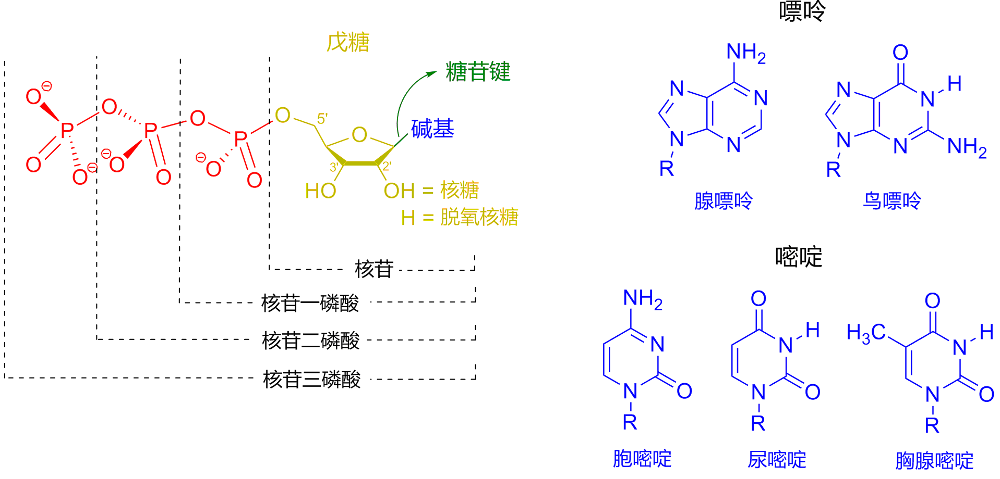
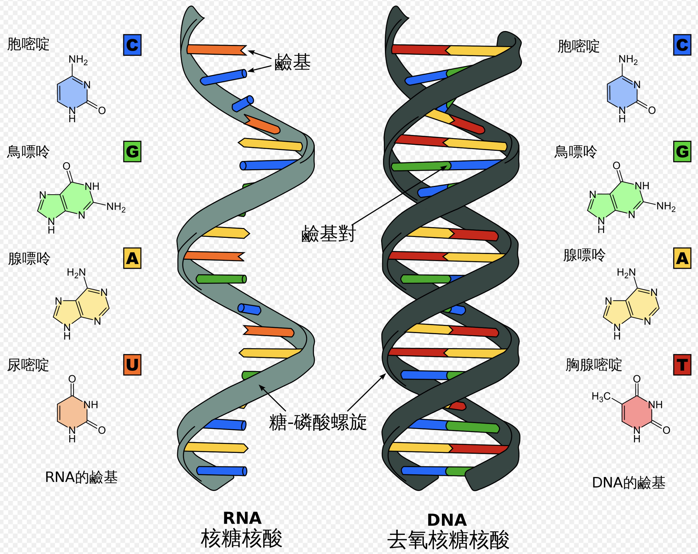

* TOC
{:toc}
---

本文部分内容摘自
* [Wikipedia DNA](https://zh.wikipedia.org/zh-cn/%E8%84%B1%E6%B0%A7%E6%A0%B8%E7%B3%96%E6%A0%B8%E9%85%B8)

## DNA 与 RNA

### DNA 含义
* DNA (short for Deoxyribonucleic Acid) 中文意思是脱氧核糖核酸，是一种生物小分子，可组成遗传指令。主要功能是信息储存。其中包含的指令，是建构细胞内其他的化合物，如蛋白质与核糖核酸所需。带有蛋白质编码的DNA片段称为基因。其他的DNA序列，有些直接以本身构造发挥作用，有些则参与调控遗传信息的表现。 

### DNA 的构成
* DNA是一种长链聚合物，组成单位称为核苷酸，而糖类与磷酸借由酯键相连，组成其长链骨架。每个糖单位都与四种碱基里的其中一种相接，这些碱基沿着DNA长链所排列而成的序列，可组成遗传密码，是蛋白质氨基酸序列合成的依据。读取密码的过程称为转录，是根据DNA序列复制出一段称为RNA的核酸分子。

* DNA 与染色体（Chromosomes）：在细胞内，DNA能组织成染色体结构，整组染色体则统称为基因组（genome）。染色体在细胞分裂之前会先行复制，此过程称为DNA复制。对真核生物，如动物、植物及真菌而言，染色体是存放于细胞核（nucleus）内；对于原核生物而言，如细菌，则是存放在细胞质中的拟核里。染色体上的染色质蛋白，如组蛋白（histone），能够将DNA组织并压缩，以帮助DNA与其他蛋白质进行交互作用，进而调节基因的转录。 

### DNA 和 RNA 的物理化学性质
* 核苷酸（nucleotide）是核酸的基本组成单位。或者说，核苷酸是核酸的单体。
* 含氮碱基（nitrogenous base）： 腺嘌呤（A）、鸟嘌呤（G）、胞嘧啶（C）、胸腺嘧啶（T）和尿嘧啶（U）
* 五碳糖：脱氧核糖 or 核糖
* 核苷酸 = 含氮碱基 + 五碳糖 + 一个或多个磷酸基团

Figure 1

## DNA 和 RNA 的碱基区别

Figure 2

* ATCG：两股脱氧核糖核酸长链上的碱基以氢键相互吸引，使双螺旋形态得以维持。这些碱基可分为两大类，以5角及6角杂环化合物组合而成的一类称为嘌呤；只有一个6角杂环的则称为嘧啶。组成脱氧核糖核酸的碱基，分别是腺嘌呤（adenine，缩写A）、胞嘧啶（cytosine，C）、鸟嘌呤（guanine，G）与胸腺嘧啶（thymine，T）。碱基、糖类分子与磷酸三者结合之后，便成为完整的核苷酸。

* 关于T和甲基化：还有一种碱基称为尿嘧啶（uracil，U），此种碱基比胸腺嘧啶少了一个位于环上的甲基，一般出现在RNA分子中，角色相当于脱氧核糖核酸里的胸腺嘧啶。通常在脱氧核糖核酸中，它会作为胞嘧啶的分解产物，或是CpG岛中还未经甲基化的胞嘧啶突变产物。

* Exmaple：少见的例外发现于一种称为PBS1的细菌病毒，此类病毒的脱氧核糖核酸中含有尿嘧啶。在某些特定RNA分子的合成过程中，会有许多尿嘧啶在酶的作用下失去一个甲基，因而转变成胸腺嘧啶，这种情形大多出现于一些在构造上具有功能，或者具有酶能力的RNA上，例如转运RNA与核糖体RNA。 

## DNA 的化学修饰
### DNA 甲基化
* 基因的表现，受染色体上的染色质结构与异染色质（基因无表现或低表现）区域里的胞嘧啶甲基化所影响。举例而言，当胞嘧啶受到甲基化时，会转变成5-甲基胞嘧啶，此作用对于X染色体的去激活、铭印和保护脱氧核糖核酸分子不被内切酶所切断（存在例外）而言相当重要。

* 5-甲基胞嘧啶容易因自然发生的脱氨作用而变成胸腺嘧啶，也因此使甲基化的胞嘧啶成为突变热点，这也解释了为什么胞嘧啶和鸟嘌呤会集中出现在CpG岛里，因为那里的甲基化作用被压制，没有甲基化的胞嘧啶所产生的突变产物并非胸腺嘧啶，而是尿嘧啶。

## DNA 的损害
* 有许多不同种类的突变原可对DNA造成损害，其中包括氧化剂、烷化剂，以及高频电磁辐射，如紫外线与X射线。不同的突变原对DNA造成不同类型的损害，举例而言，紫外线会造成胸腺嘧啶二聚体的形成，并与相邻的碱基产生交叉，进而使DNA发生损害。另一方面，氧化剂如自由基或过氧化氢，可造成多种不同形态的损害，尤其可对鸟苷进行碱基修饰，并且使双股分解。根据估计，在一个人类细胞中，每天大约有500个碱基遭受氧化损害。在各种氧化损害当中，以双股分解最为危险，此种损害难以修复，且可造成DNA序列的点突变、插入与删除，以及染色体易位。 

## DNA 生物机能概观
* 