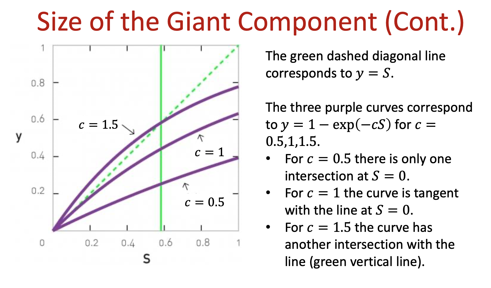

* TOC
{:toc}
---

## Chapter 2 Graph Theory

### 2.1 Degree
* Undirected Graph Average Degree, $n$ nodes, $m$ links

$$\bar{k}=\frac{1}{n}{\sum_{i=1}^{n}{k_i}}=\frac{2m}{n}$$

* Directed Graph

### 2.2 Degree Distrbution
* $n_k = \text{\#}$ of nodes with degree $k$, and $P(k)=\frac{n_k}{n}$
* Normalization condition: $\sum_{k=0}^{\infty}{p_k=1}$ or $\int_{0}^{\infty}{p(k)dk}=1$

### 2.6 Bipartite Networks
* Projections

### 2.7 Paths and Distances
* Shortest Path
* Number of Shortest Paths Between Two Nodes
* BFS Algorithm, Dijkstra for Weighted Paths

### 2.8 Connectedness
> In an undirected network, nodes $i$ and $j$ are connected if there is a path between them. 

> A network is connected if all pairs of nodes in the network are connected. A network is disconnected if there is at least one pair that is disconnnected.

* Component
> A component is a subset of nodes in a network, so that
> * there is a path between any two nodes that belong to the component
> * but one cannot add any more nodes to it that would have the same property

* Finding the Connected Components of a Network

### 2.11 Density and Sparsity
> The density of a graph is the fraction of those edges that are actually present
> $$\rho=\frac{m}{C_n^2}=\frac{2m}{n(n-1)}=<k>\frac{1}{n-1}$$

## Chapter 3 Random Networks
### 3.1 Number of Links in a Random Networks
$$c=\bar{k}=\frac{2\bar{m}}{n}=p(n-1)$$

For ease of representation, we will denote the average degree as $c=\bar{k}$

### 3.x Giant Component
> We define a giant component as a network component whose size grows in proportion to $n$.

* Constant fraction: By definition, as the size of the network grows, the average size of the giant component grows with it. Hence the largest component is constant fraction of the whole network.

> Denote by $u$ the average fraction of nodes in the random graph that do not belong to the giant component.

This means that for every other node $j$ in the network, either
* (a) $i$ is not connected to $j$ by an edge or
* (b) $i$ is connected to $j$ but $j$ is not a member of the giant component

The probability of outcome (a) is simply $1-p$

The probability of outcome (b) is $pu$

Thus the probability of not being connected to the giant component via node $j$ is $1-p+pu$

Then we have

$$u=(1-p+pu)^{n-1}$$

Simplify this equation further. First we rearrange it and substitue $p=\frac{c}{n-1}$

$$u=\big(1-\frac{c}{n-1}(1-u)\big)^{n-1}$$

Taking log of both sides yields

$$\log{u}=(n-1)\log{[1-\frac{c}{n-1}(1-u)]}\approx-(n-1)\frac{c}{n-1}(1-u)\\
=-c(1-u)$$

Taking exponentials of both sides gives

$$u=exp[-c(1-u)]$$

Denote by $S$ the fraction of nodes in the giant component and then $S=1-u$, and 

$$S=1-exp(-cS)$$

#### Size of Giant Component
Depending on the value of $c$

